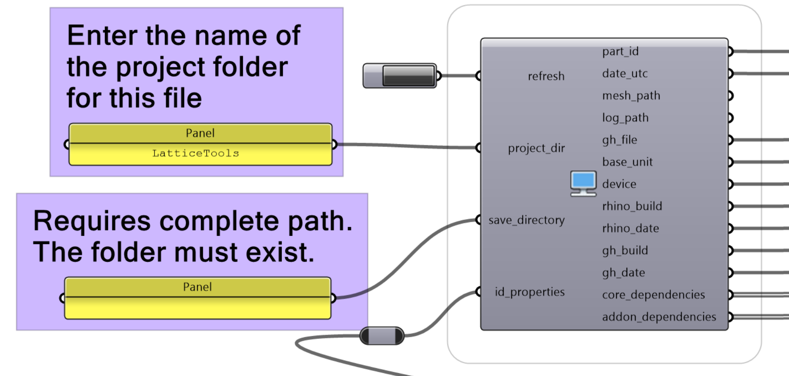
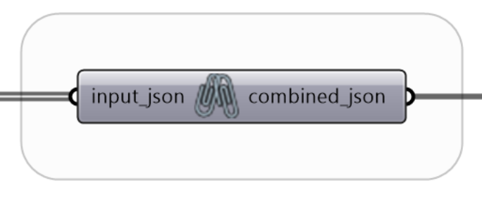
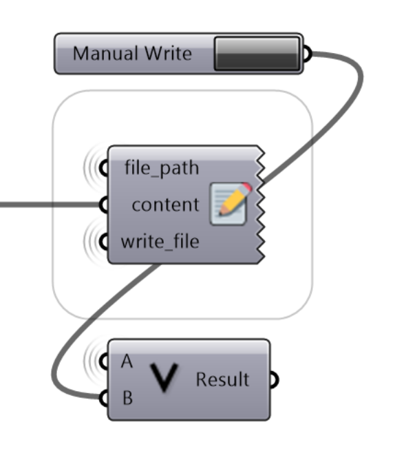
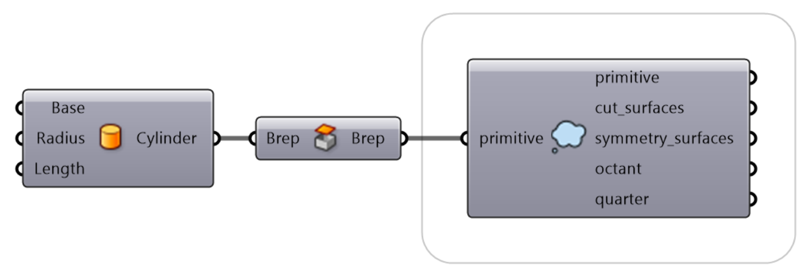
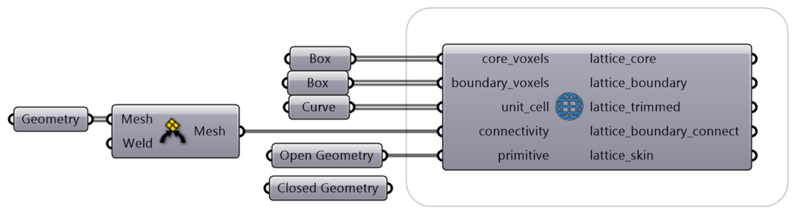
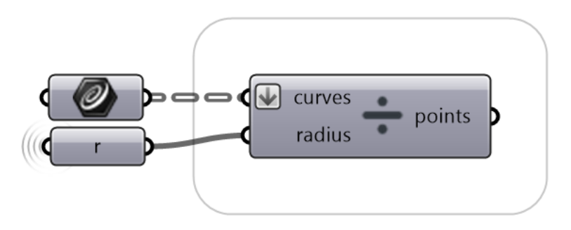
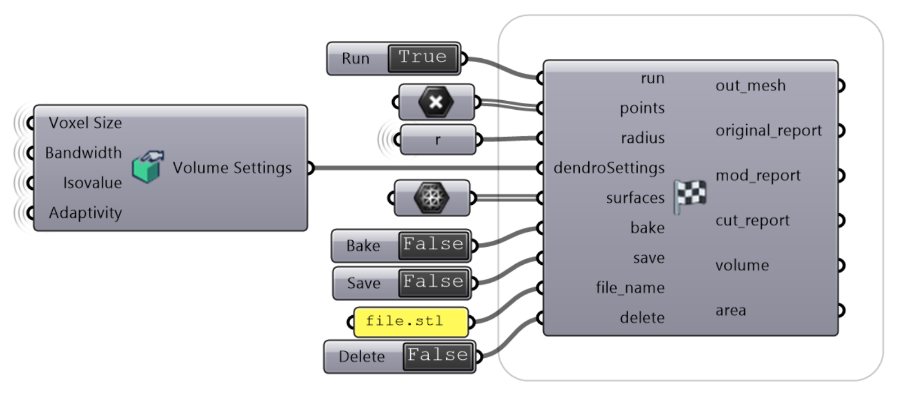
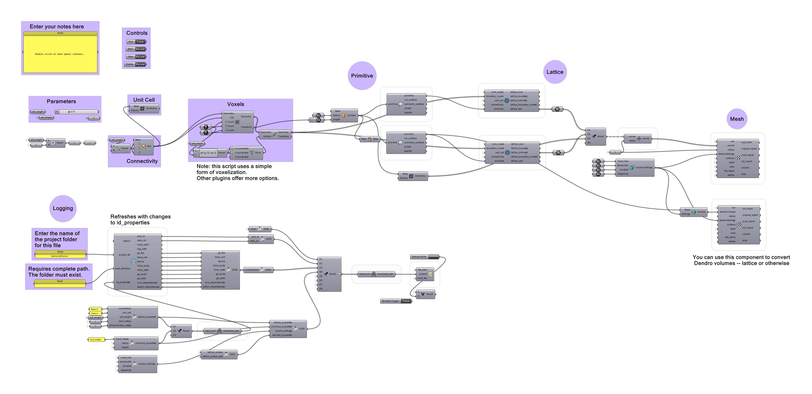

\newpage

# Overview

LatticeTools is a plugin that implements the key innovations found in the paper, [_Scalable, process-oriented beam lattices: Generation, characterization, and compensation for open cellular structures_](https://doi.org/10.1016/j.addma.2021.102386)[^Woodward2021] -- namely the process of generating an open, conformal skin to make self-supporting lattice structures for 3D printing. It also includes some helper functions and components for logging information about the lattice design process, which can be used for downstream analysis.

[^Woodward2021]: https://doi.org/10.1016/j.addma.2021.102386

## Origin

The LatticeTools components were originally developed by a member of the Fromen Lab in pursuit of their degree at the University of Delaware. The contents herein do not express the positions of the respective organization(s), institution(s), or funding source(s). The code for the original alpha version of the components can be found on [GitHub](https://github.com/irw-udel/dev-lattice-generation).[^dev-lattice-generation]

[^dev-lattice-generation]: https://github.com/irw-udel/dev-lattice-generation

# Setup

## Dependencies

Built originally with Rhino 6. Later versions may yield slightly different results.

Make sure these plugins are installed before getting started.

- Dendro v0.9
- jSwan v1.2
- Weaverbird v0.9

All of these can be installed manually or from Yak, the package manager. In Rhino 6, run the `_TestPackageManager` command to access it. Later versions can access via the `PackageManager` command.

There are a number of other relevant plugins available. To name a few:

- Crystallon
- Intralattice
- Axolotl

## Installation

Follow the typical procedure for installing downloaded Grasshopper plugins. You can find a video here on [food4Rhino](https://www.food4rhino.com/en/faq?lang=en#users-install-grasshopper-plugin).[^food4rhino-1]

[^food4rhino-1]: https://www.food4rhino.com/en/faq?lang=en#users-install-grasshopper-plugin

Briefly:

1. Download the `LatticeTools.ghpy` file, unzip if necessary, and unblock it.
1. Drag the `LatticeTools.ghpy` file into the Grasshopper canvas, and the new tab should automatically appear. If not, try restarting Rhino/GH.
1. Open `LatticeTools-Demo.gh` to see components in context.

## Compiling from source

1. Open Rhino and run `EditPythonScript`.
1. Open `main.py` from the main directory of LatticeTools.
1. Click the green play button (F5) to run the script.
    - After running, a `LatticeTools-XXX.ghpy` will appear in the folder.
    This file can be installed onto your system.

\newpage
# Components

## Logging

### Logging - System Info

_Shortcut: SystemInfo_

Logging is one of the most important features of this plugin. The demo and scripts used in practice make extensive use of jSwan to record information in a portable format (JSON) that can be processed by both people and computers. This component reports relevant information for reproducibility and provides utilities for organizing the structures you make.

Inputs:

- `Refresh`: A **Boolean** value to refresh the component and generate new outputs.
- `Project Dir`: The name of the parent project folder above the GH script. This is used to report the GH file in a more portable format.
    - For example, if the GH file is at `C:/Users/user/Projects/manuscript-lattice/scripts/lattice.gh`, the input could be either `Projects` or `manuscript-lattice`.
    - If there are unexpected results, try including a trailing slash after the folder name.
- `Save Directory`: The path to the folder where mesh and log files should be saved. Must be the complete path.
- `ID Properties`: A **single** text string of key properties about the lattice, to be used for generating a unique ID.

Outputs:

- `Part ID`: A ~unique ID for the generated part. It consists of three elements:
    - The date of generation (YYMMDD)
    - A three-character string based on the `ID Properties` input
    - A two-character string based on the time of generation
- `Date UTC`: The UTC time in the format "%Y-%m-%dT%H:%M:%S"
- `Mesh Path`: The file location to save the mesh as `Part ID.stl`
- `Log Path`: The file location to save the logged information.
- `GH File`: The path of the current GH file. This will only work if the script has been saved. If `Project Dir` is not provided, this will be the full path to the script, which contain information about your folder structure.
- `Base Unit`: The base length unit of the document, e.g. mm.
- `Device`: A scrambled representation of the device used for computation.
- `Rhino Build`: The running version of Rhino.
- `Rhino Date`: The date of the running Rhino version.
- `GH Build`: The running version of Grasshopper.
- `GH Date`: The date of the running Grasshopper version.
- `Core Dependencies`: Native Grasshopper components used in the definition.
- `Add-on Dependencies`: Plugin components used in the definition.

### Logging - Combine JSON

_Shortcut: combinejson_

A utility to combine a list of JSON inputs into a single JSON object. Useful for aggregating all relevant parameters and writing to the log file. If you're not familiar with JSON or need a refresher, you can review [this article, The Complete Guide to Working with JSON.](https://www.nylas.com/blog/the-complete-guide-to-working-with-json/)[^json-article]

[^json-article]:https://www.nylas.com/blog/the-complete-guide-to-working-with-json/

Inputs:

- `Input JSON`: A **list** of JSON objects to combine.

Outputs:

- `Output JSON`: The input JSON merged into a single object.

### Logging - Write

_Shortcut: Logger_

This component takes a text string and writes it to the supplied file path whenever it is triggered.

Inputs:

- `File Path`: The full path to the file to write.
- `Content`: The text to write to the file. Can be a **list** of strings or a **single** string.
- `Write File`: A **Boolean** parameter to trigger writing the file.
    - If the file already exists, the content is appended to the existing file.
    - This parameter can be the same as the toggle applied to the `Mesh - Meshing` component's `Save` parameter or another element related to running the script.
    - In the image shown, this parameter can be set to `True` via a button OR a run-linked toggle.

\newpage
## Prepare

### Primitive - Prepare (Origin)

_Shortcut: Primitive_

Supplying a primitive shape is one of the first steps of generating a lattice structure. This component converts an input primitive to a mesh for lattice generation. 

Inputs:

- `Primitive`: A **single** geometry (mesh or brep). Center the input at (0,0,0).

Outputs:

- `Primitive`: A mesh representation of the primitive (to supply to the lattice population component).
- `Cut Surfaces`: Top and bottom cutting planes for trimming the final lattice mesh.
- `Symmetry Surfaces`: Interior surfaces to make a lattice via octant-based symmetry.
- `Octant`: A cut octant version of the primitive.
- `Quarter`: A cut quarter version of the primitive. (May not always be successful.)

\newpage
## Lattice

### Populate - Lattice (Uniform)

_Shortcut: UniformLattice_

This component takes a description of the design space and returns the network of curves making up the self-supporting lattice structure. The raw outputs are included for any additional processing. Experiment with using a closed or open primitive for generating the lattice skin.

Inputs:

- `Core Voxels`: A **list** of boxes that are contained _within_ the primitive. Populated with unit cell only.
- `Boundary Voxels`: A **list** of boxes that cross the boundary of the primitive. Populated with unit cell and connectivity. If you don't have access to both core and boundary voxels, supply all as boundary voxels.
- `Unit Cell`: A **list** of curves representing the unit cell geometry.
- `Connectivity`: A **single** description of the connectvity between unit cell curves. Most-easily supplied as a mesh.
- `Primitive`: A **single** primitive or object used to trim the lattice curves.

Outputs:

- `Lattice Core`: Result of populating core voxels with the unit cell.
- `Lattice Boundary`: Result of populating boundary voxels with the unit cell.
- `Lattice Trimmed`: Lattice curves contained within the primitive. Used for further processing.
- `Lattice Boundary Connect`: Result of populating boundary voxels with the unit cell connectivity.
- `Lattice Skin`: Lattice curves making up the conformal open skin.

\newpage
## Segment Lattice

_Shortcut: SegmentLattice_

With Dendro, a list of points are converted into the lattice mesh. This component converts the lattice curves into that list of points, [building on the Dendro logic](https://github.com/ryein/dendro/pull/5/files).[^dendro-points]

[^dendro-points]: https://github.com/ryein/dendro/pull/5/files

Inputs:

- `Curves`: A **list** of the curves in the lattice.
- `Radius`: A **single** minimum radius value for generating the lattice.

Outputs:

- `Points`: The points to be meshed.

\newpage
## Meshing

### Mesh - Meshing (Points)

_Shortcut: MeshLattice_

Inputs:

- `Run`: A **Boolean** value of whether to run the meshing process.
- `Points`: A **list** of points to convert to a mesh with Dendro.
- `Radius`: A **single** radius value or a **list** of radius values corresponding to the `Points` input. 
- `Dendro Settings`: Settings used to set up Dendro computation. As a starting point, try: Voxel Size = 0.035, Bandwidth = 1, Isovalue = 0, Adaptivity = 0.9. See the Dendro documentation for more information on these parameters.
- `Surfaces`: A **list** of planes used to trim the final mesh. Output of the Primitive - Prepare (Origin) component.
- `Bake`: A **Boolean** value of whether to bake the mesh into Rhino.
- `Save`: A **Boolean** value of whether to save the mesh with the supplied file name.
- `File Name`: A **single** file name containing the full path to the save location.
- `Delete`: A **Boolean** value of whether to delete the mesh from the Rhino environment after saving the file.

Outputs:

- `Out mesh`: The converted mesh.
- `Original Report`: A log of the pre-processed mesh. Includes 
    - The name of the report (`original_report`)
    - Validity
    - The number of naked edges in the mesh
    - Closed/Open
    - Manifold
    - Number of separate meshes
    - Number of vertices
    - Memory estimate in MB
    - A log report of validity
- `Mod Report`: A log of the mesh after repair and processing. Additionally includes:
    - The number of degenerate faces
    - The number of quad faces converted to triangles
    - Whether the mesh normals were flipped
- `Cut Report`: A log of the mesh after cutting with the supplied `Surfaces`. Additionally includes:
    - Whether the cutting surfaces were translated
    - The number of mesh faces before filling holes
    - The output of filling mesh holes
    - The updated number of mesh faces
- `Volume`: The calculated volume of the mesh (in document units)
- `Area`: The calculated surface area of the mesh (in document units)

### Mesh - Meshing (Volume)

In cases requiring more advanced modeling techniques, this component is provided to convert a Dendro volume to mesh. The parameters correspond to the `Mesh - Meshing (Points)` component.

\blandscape
<!-- https://stackoverflow.com/questions/25849814/rstudio-rmarkdown-both-portrait-and-landscape-layout-in-a-single-pdf -->

# Demo

\elandscape

## Summary
As outlined in the paper[^Woodward2021], the lattice generation process begins with a primitive geometry and voxel space. In this demo, we are using a simple voxelization method that defines a set of voxels first and does not derive voxels from the primitive geometry. This is primarily for the purposes of having a standalone example; more advanced voxelization tools like those available from Crystallon are preferred for use in practice.

A user can define the inputs for cell length and dimensionless radius under the "Parameters" group. Simultaneously, the logging components take the voxelization and primitive parameters as inputs for generating a part ID. In practice, a primitive might be defined _before_ the lattice design parameters, so that the voxel dimension can be defined as an absolute value or relative to the primitive size.

From this cylindrical primitive, we generate an open and closed mesh for input to the lattice population component. The open mesh is used for computing the skin (with open cylinder caps), and the closed mesh is used for generating the trimmed lattice. Additionally, the wireframe is provided to generate the circular curves for the lattice (a slighly more advanced method would remove the vertical line in the wireframe).

These curves are processed into points and finally converted to the lattice mesh, which can be saved and 3D printed.

Give it a try for yourself!